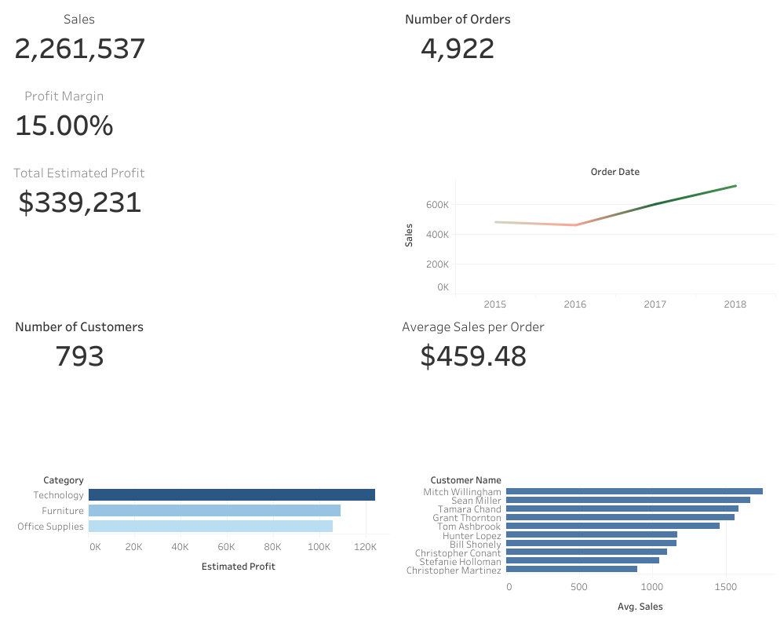

# Superstore Sales Analysis

## Project Overview

This project analyzes retail sales data from the Superstore dataset using Python, SQL, and Tableau. The goal was to identify sales trends, customer behavior, and key business insights that could help improve profitability and decision-making.

The analysis includes:
- Data cleaning and preprocessing
- Exploratory Data Analysis (EDA)
- SQL-based business queries
- KPI analysis
- Interactive Tableau dashboard

---

## Tools & Technologies

- Python
- Pandas
- NumPy
- SQL
- Tableau
- Jupyter Notebook / Google Colab
- Matplotlib / Seaborn

---

## Key Business Questions

- How have sales changed over time?
- Which customers generate the most revenue?
- What is the average sales value per order?
- Which categories and regions perform best?
- What trends can be identified from the data?

---

## Key KPIs

- Total Sales: $2.26M
- Number of Orders: 4,922
- Number of Customers: 793
- Average Sales per Order: $459.48

---

## Dashboard Preview



---

## Tableau Dashboard

[View Interactive Tableau Dashboard Here](https://public.tableau.com/views/RetailSalesAnalysisDashboardTableau/Dashboard1?:language=en-US&:sid=&:redirect=auth&:display_count=n&:origin=viz_share_link)

---

## Key Insights

- Sales showed strong growth from 2016 to 2018
- A small number of customers contributed significantly to total revenue
- Sales trends indicate increasing business performance over time
- Customer purchasing behavior varied across segments and regions

---

## Recommendations

- Focus marketing efforts on high-value customers
- Improve retention strategies for repeat buyers
- Analyze low-performing categories for profitability improvements
- Continue monitoring sales trends to support forecasting

---

## Repository Structure

```text
superstore-sales-analysis/
│
├── superstore_sales_analysis.ipynb
├── README.md
├── Dashboard 1.png
├── requirements.txt
└── dataset.csv
